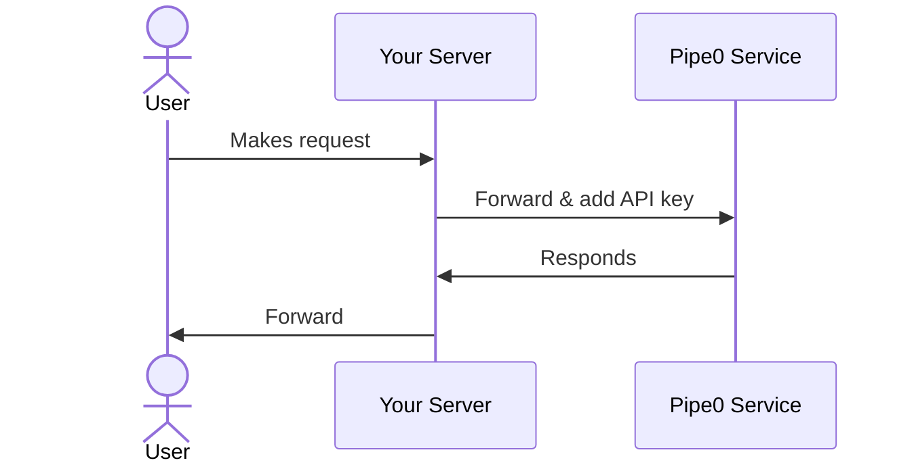

## Setup

You can make request to the pipe0 API using API keys.

We expect that you make requests from a secure server that is able to store an API key. For security reasons
you should never store API keys in your client side code or in public repositories.

## API keys

You can create an API key by signing in to your dashboard. Go to settings -> API-Keys -> Create.