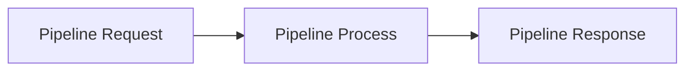

## Introduction

When you enrich data, you send a [pipeline request]() to our severs. After processing you receive a [pipeline response]().

Our API provides only two endpoints allowing you to build flexible pipelines that combine both enrichments pipes for `people` and `companies`.


<br />
When we receive your request, our servers (or [SDK]()) do the heavy lifting:

- Validate the request
- Determine best order of execution of pipes (pipes in your request can be unsorted)
- Normalizing your input
- Enriching data by always using all required fields and optional fields when they are present.

## Async processing

All processing is done asynchonously. After sending a pipeline request, our severs return a pipeline responnse with an `id`
and processing status.

As of today, we anly offer asynchonous processing. This has several advantages:

- Avoid request timeouts while processing pipelines 
- Failed tasks can be retried up to 5 times

We expect users to poll the endpoint `/v1/check` and stop the polling once the status of a task is set to `complete`. Appropriate
polling intervalls are 500-5000ms.

Excessive polling results in rate limiting.

## Pipeline Request

Pipeline requests define two things:

- What data should be enriched (Input)
- What enrichments should be added to your data (Pipes)

It's best to think of pipelines like lego. The pieces must fit into each other. Each [pipe](/docs/pipe) will define a set of input fields 
and one or more output fields.

Input fields of a pipe _must_ be provided by the input _or_ be output by another pipe.

If a property exists in every input it is considered _required_ if it only exists in some input, it is marked as _optional_.

You can find all available pipes in the [Pipe Catalog](/docs/pipe-catalog).

### Request Inputs

Input sent with your pipeline request is normalized. So, if a property exists in some inputs it will be added to the remaining input with a 
value of `null`.

Every input must contain a unique Id. To create unique ids you can use libraries like [uuid](https://www.npmjs.com/package/uuid) or [cuid](https://www.npmjs.com/package/@paralleldrive/cuid2).

### Request Validation

Your request is validated before it is processed. If inputs and outputs don't line up, the request will be rejected without processing.

If your request fails during processing, we do our best to process your request to completion by only marking affected fields as `failed`.

Requests can fail during processing due to various reasons. Here are some examples:

- Vendor downtime
- Network issues
- Expired credentials


### Example Pipeline Request


```bash
curl -X POST 'https://api.pipe0.com/v1/run' \
-H "Authorization: Bearer YOUR_TOKEN" \
--data-raw '{
"input": [
    {
        "id": "15991b91-4b3c-4907-a7cc-b838e223004d",
        "email": "jane@me.com",
        "name": "Jane Smith",
        "businessEmail": null
    },
    {
        "id": "15991b91-4b3c-4907-a7cc-b838e223004d",
        "email": "jane@me.com",
        "linkedInProfileUrl": "https://linkedin.com/in/janesmith",
        "name": "Jane Smith",
        "businessEmail": null
    }],
    "pipes": [{           # <- This is a pipeline
        "name": "PeopleBusinessEmailWaterfallV1",
        "config": {
        "providers": [{"name": "clearbit"}],
        "outputFieldNames": {"businessEmail": ""},
        "inputFieldNames": {"name": "", "email": "", "random": ""}
        }
    }
]
}'
```

## Pipeline Response

After a successful [pipeline request](/docs/pipeline#pipeline-request) you will receive a pipeline response.

Depending on your configures pipes and input values a response might look like this.


```JSON
{
	"success": true,
	"error": null,
	"data": {
		"id": "x36s4vhai2q0opr19s950476",
		"type": "enrichment",
		"status": "pending",
		"order": [
			"15991b91-4b3c-4907-a7cc-b838e223004d",
			"b0015d04-f25a-46ed-8131-4af0f9365880"
		],
		"errors": [],
		"fields": {
			"id": {
				"name": "id",
				"type": "string",
				"addedBy": "input",
				"required": true
			},
			"name": {
				"name": "name",
				"type": "string",
				"addedBy": "input",
				"required": true
			},
			"email": {
				"name": "email",
				"type": "string",
				"addedBy": "input",
				"required": true
			},
			"businessEmail": {
				"name": "businessEmail",
				"type": "string",
				"addedBy": "PeopleBusinessEmailWaterfallV1",
				"required": true
			},
			"linkedInProfileUrl": {
				"name": "linkedInProfileUrl",
				"type": "string",
				"addedBy": "input",
				"required": true
			}
		},
		"records": {
			"15991b91-4b3c-4907-a7cc-b838e223004d": {
				"id": "15991b91-4b3c-4907-a7cc-b838e223004d",
				"errors": [],
				"fields": {
					"id": {
						"meta": null,
						"type": "string",
						"value": "15991b91-4b3c-4907-a7cc-b838e223004d",
						"errors": [],
						"status": "completed",
						"addedBy": "input",
						"resolvedBy": "input"
					},
					"name": {
						"meta": null,
						"type": "string",
						"value": "Jane Smith",
						"errors": [],
						"status": "completed",
						"addedBy": "input",
						"resolvedBy": "input"
					},
					"email": {
						"meta": null,
						"type": "string",
						"value": "jane@me.com",
						"errors": [],
						"status": "completed",
						"addedBy": "input",
						"resolvedBy": "input"
					},
					"businessEmail": {
						"meta": null,
						"type": "string",
						"value": "my@email.com",
						"errors": [],
						"status": "completed",
						"addedBy": "input",
						"resolvedBy": "input"
					},
					"linkedInProfileUrl": {
						"meta": null,
						"type": "string",
						"value": "https://linkedin.com/in/janesmith",
						"errors": [],
						"status": "completed",
						"addedBy": "input",
						"resolvedBy": "input"
					}
				}
			},
			"b0015d04-f25a-46ed-8131-4af0f9365880": {
				"id": "b0015d04-f25a-46ed-8131-4af0f9365880",
				"errors": [],
				"fields": {
					"id": {
						"meta": null,
						"type": "string",
						"value": "b0015d04-f25a-46ed-8131-4af0f9365880",
						"errors": [],
						"status": "completed",
						"addedBy": "input",
						"resolvedBy": "input"
					},
					"name": {
						"meta": null,
						"type": "string",
						"value": "Bob Example",
						"errors": [],
						"status": "completed",
						"addedBy": "input",
						"resolvedBy": "input"
					},
					"email": {
						"meta": null,
						"type": "string",
						"value": "bob@example.com",
						"errors": [],
						"status": "completed",
						"addedBy": "input",
						"resolvedBy": "input"
					},
					"businessEmail": {
						"meta": null,
						"type": "string",
						"value": null,
						"errors": [],
						"status": "queued",
						"addedBy": "PeopleBusinessEmailWaterfallV1",
						"resolvedBy": null
					},
					"linkedInProfileUrl": {
						"meta": null,
						"type": "string",
						"value": "https://linkedin.com/in/bobexample",
						"errors": [],
						"status": "completed",
						"addedBy": "input",
						"resolvedBy": "input"
					}
				}
			}
		},
		"isTestMode": true,
		"enrichments": [
			{
				"name": "PeopleBusinessEmailWaterfallV1",
				"config": {
					"providers": [
						{
							"name": "clearbit"
						}
					],
					"inputFieldNames": {
						"name": "",
						"email": "",
						"random": ""
					},
					"outputFieldNames": {
						"businessEmail": ""
					}
				}
			}
		],
		"organizationId": "di21noyh28g36ie146m5icew",
		"createdAt": "2025-03-06T23:51:38.256Z",
		"updatedAt": "2025-03-06T23:51:38.256Z"
	}
}
```

